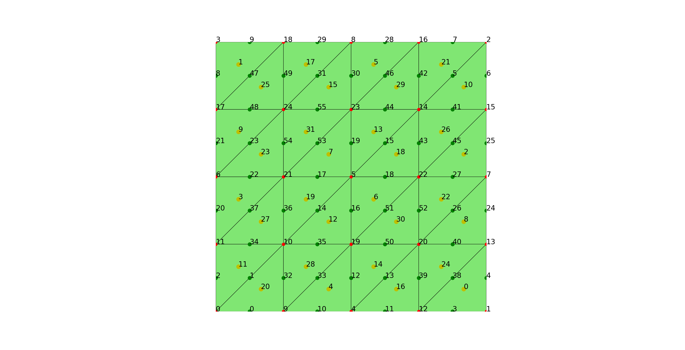

# FEALPy: Finite Element Analysis Library in Python

在学习陈龙老师 IFEM 软件包基础上， 我开发了一个 Python 有限元软件包 FEALPy。
FEALPy 借助 Python 中的多维数组模块 Numpy， 完全继承了 IFEM 面向数组的编程模式
， 同样可以用简短的代码写出比较高效的数值计算程序。 与 IFEM 不同的是， FEALPy
采用了面向对象的编程模式来组织程序，与面向过程的编程模式相比， 大大提高了程序的
重用性和可扩展性。

FEALPy 开源托管在 Github 上，主页为： github.com/weihuayi/fealpy, 欢迎大家试用
。目前 FEALPy 核心 框架已经搭建完成， 主要实现了下面的模块

* 丰富的网格数据结构类型, 包括二维、三维的常见网格类型。
* 简单区域上的网格生成。
* 任意维的高次拉格朗日有限元空间。
* 高次曲面有限元空间。
* 多边形上的高次虚单元空间。
* 自适应算法,包括三角形网格的二分法, 四叉树和八叉树。


今天，我将介绍如何在 Ubuntu 下安装 FEALPy， 后续的文章中我也会介绍在 Windows 和
Mac 系统下的安装配置。 

在 FEALPy 的主页上， 点击 `clone or download` 按钮， 在弹出的小页面中点击
`Download Zip` 直接下载得到压缩文件 `fealpy-master.zip`, 然后

```
$ unzip fealpy-master.zip # 解压得到 fealpy-master 文件夹
$ cd fealpy-master/ # 进行 fealpy 主目录
```

或者在 Ubuntu 命令行终端中直接用 git 克隆一份：

```
$ git clone https://github.com/weihuayi/fealpy.git
$ cd fealpy/ # 进入 fealpy 主目录
```


下面首先安装 Python 环境

```
$ sudo apt install python3     # python 3.x 解释器
$ sudo apt install python3-pip # python 软件包管理器
$ sudo apt install python3-tk  # matplotlib 需要的后 GUI 程序 
$ sudo apt install ipython3    # python 3.x 的高级交互环境 
```

当然， 也可以直接安装 Anaconda 集成开发环境。但我建议还是自己来配置，这样可以帮
助你更好理解编程环境运行机制。

在 FEALPy 的主目录里运行下面安装命令, 就可以把 FEALPy 安装到 Ubuntu 系统中：

```
$ sudo pip3 install -e ./
```

注意这里的 `-e` 表示**软安装**, 即安装一个软链接到系统目录下， Ubuntu
默认的安装目录是 `/usr/local/lib/python3.6/dist-packages`。
这样安装的好处是当更新 FEALPy 后， 你马上可以在系统的其它位置调用最新的
FEALPy。特别是用 `git clone` 命令克隆的版本，在 `fealpy` 目录下， 运行命令：

```
$ git pull 
```

就可以更新 FEALPy 到最新版本。

接着就可以进行测试了， 把下面代码拷贝到一个文本文件中，命名为 `test_trianglemesh.py`:

```
import numpy as np
import matplotlib.pyplot as plt
from fealpy.mesh import TriangleMesh

# [0, 1]^2 区域上的网格
node = np.array([
    (0, 0), 
    (1, 0), 
    (1, 1),
    (0, 1)], dtype=np.float)
cell = np.array([
    (1, 2, 0),
    (3, 0, 2)], dtype=np.int)

tmesh = TriangleMesh(node, cell) # 建立三角形网格对象
tmesh.uniform_refine(2)          # 一致加密两次
node = tmesh.entity('node')      # 获得节点数组
cell = tmesh.entity('cell')      # 获得单元数组

# 画图
fig = plt.figure() # 建立画图对象
axes = fig.gca()   # 获得坐标系
tmesh.add_plot(axes) # 在坐标系中画网格
tmesh.find_node(axes, showindex=True) # 显示所有节点编号
tmesh.find_edge(axes, showindex=True) # 显示所有边的编号
tmesh.find_cell(axes, showindex=True) # 显示所有单元的编号
plt.show()
```

最后在命令行中运行

```
$ python3 test_trianglemesh.py
```

就可以显示下面的图形



在后面的文章中，我会对 FEALPy 中已有的各个模块进行详细的介绍。 我真心希望有更多
的人来使用 FEALPy， 这样它才能变的更好，也会对大家更有用。 
