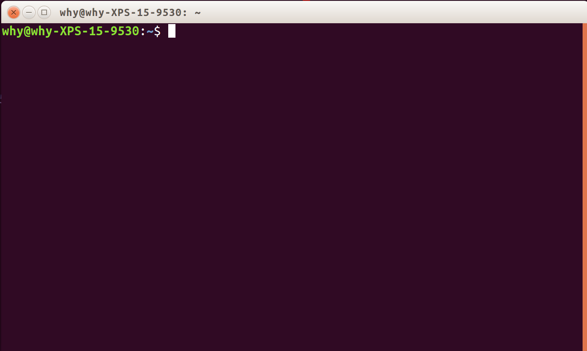

# Python 编程环境的安装

编程是一项实践性很强的活动。 经常写是学好编程的最基本保证。 在学习 Python 编程之前，
你首先要给自己搭建一个环境， 让自己随时都能写上一点程序。

下面主要介绍几种 Python 编程环境的搭建过程。

## [Anaconda](https://www.anaconda.com/) 

首先介绍最简单的一种方式， 就是安装 Anaconda， 这是当前最流行的跨平台 Python 数
据科学平台软件包， 下载地址： https://www.anaconda.com/download/ ， 其中有
Windows、macOS 和 Linux 三种系统的 安装包， 最新版本是 5.2， 内置的 Python 版本
是 3.6。 Anaconda 中已经集成了大部 分我们平时最常用的 Python 软件模块。 另外，
也提供了很多第三方 的网上软件模块仓 库， 可以利用 `conda` 命令来安装你需要的软
件包。

Windows 安装 Anaconda 之后， 就会在开始菜单中出现一个 Anaconda 文件夹， 下面有
各种工具的启动链接：

* **Anaconda Cloud**: 
Anaconda 的云平台，就是一个网上编程环境， 它提供软件包、 笔记和环境的管理服务，
你可以和别人共享自己的程序和笔记。用 Cloud 的好处是， 它会帮你你完成软件包和环
境的更新管理任务， 你只用专注编程就可以啦。 
* **Anaconda Navigator**: 就是一个导览啦， 告诉你 Anaconda 中有什么。
* **Anaconda Prompt**: 就是 Anaconda 的命令终端， 用 `conda` 命令管理本地 Python 软件包的安装和卸载。
* **IPython**: Python 的高级交互终端， 可以在里面快速获得帮助，测试代码的运行效果等。
* **Jupyter Notebook**: 一个交互计算的 Web 应用， 启动后会在浏览器中打开， 你可
    以写包含代码的文档笔记， 注意其中的代码是可以直接运行的哦。 
* **Jupyter QTConsole**: 和 IPython 其实是一个东西， 只不过用 QT 实现的界面。
* **spyder**: Python 的集成开发环境， 有与 Matlab 类似的界面。

而 Linux 和 MacOS 系统中安装 Anaconda 之后， 在你的主目录中就会出现一个 Anaconda 的文件夹，
并且会自动屏蔽系统中已经安装的 Python。 你需要打开你的命令行终端来运行上面的命
令。

## Ubuntu 16.04 系统

我在这一节首先介绍如何手工配置 Linux 系统下的 Python 编程环境， 然后介绍怎么调
用相关的程序。 Linux 下安装 Anaconda 后， 也是同样的方式调用的。 

首先按下 `Ctrl + Alt + T` 快捷键打开命令行终端， 类似下面的界面：



下面安装 Python 语言基础软件包 `python3` 和 Python 软件模块管理器 `pip3`。  

```
$ sudo apt install python3 # 语言基础软件包
$ sudo apt install python3-pip # python 软件模块管理器
```
注意这里安装的是 Python 3。

安装完成， 可以打印版本信息测试一下：

```
$ python3 -V
Python 3.5.2
$ pip3 -V 
pip 18.0 from /usr/local/lib/python3.5/dist-packages/pip (python 3.5)
```

进一步安装 Python 的高级交互终端 IPython:

```
$ sudo apt install ipython3
```

在命令行终端中运行 `ipython3`:

```
$ ipython3
Python 3.5.2 (default, Nov 23 2017, 16:37:01) 
Type "copyright", "credits" or "license" for more information.

IPython 5.1.0 -- An enhanced Interactive Python.
?         -> Introduction and overview of IPython's features.
%quickref -> Quick reference.
help      -> Python's own help system.
object?   -> Details about 'object', use 'object??' for extra details.

In [1]: print("Hello Python World!")
Hello Python World!

In [2]: 
```

IPython 是交互式学习 Python 的好工具。 你可以很方便的在里面获得帮助文档， 和快速
测试自己的想法。 

下面安装 Python 最基本的科学计算软件模块：

```
$ sudo -H pip3 install numpy 
$ sudo -H pip3 install scipy
$ sudo -H pip3 install matplotlib
$ sudo -H pip3 install sympy
```

经过以上步骤， 你已经完成 Python 编程环境的配置了。
下面就是找一款好的编辑器写 Python 程序了， 我推荐使用
[vim](https://www.vim.org/)。 


当然， 很多人更喜欢用集成开发环境来写程序， 这里推荐使用[spyder](https://www.spyder-ide.org/)：

```
$ sudo apt install spyder
```

它的界面类似 Matlab, 所以很适合从 Matlab 迁移过来的用户。

## 我很懒， 上面都不适合我

这没关系， 我推荐你一个数据科学学习网站 Dataquest: https://www.dataquest.io 。

你只要注册一个用户， 选择一个学习路径， 就可以开始学习 Python 基础知识了。 这个
学习网站的好处是， 你只要按照它设计的学习路径学就可以了。 一次只学一个小知
识点， 知识点的结束是编程练习， 你通过测试就可以学习下面的内容。 一切都在网上
完成， 你完全不用装什么环境， 而且随时随地都可以学习。

当然内容是全英语的。 你可能会说， 我英语不好， 这个推荐还不好。 没关系， 我还有
一个中文的网站推荐， 就是**数据嗨客平台**： http://hackdata.cn/ ， 里面有很多数
据科学的课程， 包括 Python 的基础课程， 但可能要**收费**才能用哦。

唉， 这个世界不总那么完美啊！

## 总结说明 

上面的搭建过程介绍的很简单， 有很多细节还需要你多查一查网络，
或者在使用过程中再更深入的了解。 

再强调一点， 在学习使用工具的过程中， 你一定要有效率意识，
要不时的想一想， 是不是还有更好的操作方法， 并且多查多问，
你的水平自然就会不断提高， 最终成为一个顶尖高手。 

祝 Python 能够成为你学习、工作和生活的好朋友。
