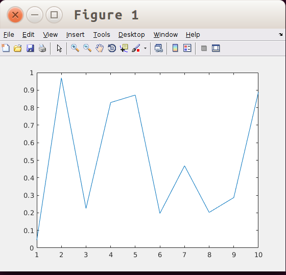

# Matlab Engine for Python

因为种种原因， 有时候需要在 Python 和 Matlab 之间传递数据。 这时可以用 `scipy` 中的 `io` 模块， 具体用法如下：

```
import scipy.io as sio
# 1. 读入
# 假设 mesh.mat 是 Matlab 保存的网格数据， 包括两个变量 `node` 和 `elem`
data = sio.loadmat(‘mesh.mat’) # 读入 mat 文件
node = data['node']
cell = data['elem'] - 1 # Matlab 中编号是从 1 开始的， 读为 numpy 数组要减 1

# 2. 写出
data = {'node':node, 'elem': cell+1} # 生成一个 dict 数据 data
sio.savemat('python-mesh.mat', data) # 把 data 写入 mat 文件
```

但这种用法违背了**尽可能在一个环境下完成任务**的原则， 用 Python 保存完数据你还要打开 Matlab， 再读取数据处理， 这样的工作效率显然不是最高的。 做事情一定要有效率意识， 换个说法就是**偷懒**意识， 这是我们人类科技不断进步的主要动力， 也是一个人学习的最大动力来源。 当然在**学习上**我们不能**偷懒**， 因为学习的目的就是为了**更好地偷懒**。

但有时候还是需要用 Matlab 做点事情（毕竟大家习惯用了）， 比如发现 matplotlib 有时画出的图不满意， 但你的论文又急需一张更满意的图时。 在这种情形下， 你首先要问自己： 能否省点事不离开 Python 环境， 又能用到 Matlab? 有了这样的问题， 你就可以行动了， 比如 google 和问别人。

Matlab 提供了一个 Python 编程接口 Matlab Engine for Python。 在 Matlab 的根目录下， 进入 `extern/engines/python`, 执行一个简单的安装命令即可， 示例代码如下：

```
cd /opt/matlab/R2018a/extern/engines/python/
sudo python3 setup.py install
```

下面给出一些简单的用法， 其它情形请自己脑补和 google：

```
import numpy as np
import matlab.engine
eng = matlab.engine.start_matlab() # 启动一个 Matlab 的 session

a = np.random.rand(10) # 生成一个长度为 10 的随机矩阵， 元素在 0 和 1 之间
A = matlab.double(a.tolist()) # 转化为 matlab 的矩阵
eng.sqrt(A) # 计算矩阵的开方
eng.plot(A) # 画图
eng.max(A, nargout=1) # 返回 A 最大值
eng.max(A, nargout=2) # 返回 A 的最大值及其位置
```
画出的图如下：



当然， 如果做了足够的搜索，你会发现 Matlab Engine for Python 不是唯一的选择， 你的选择还有 [Transplant](https://github.com/bastibe/transplant), 接口做的比 Matlab Engine for Python 更简洁一点， 可以直接用 numpy 数组做参数。 安装很简单：

```
sudo -H pip3 install transplant
```

下面给出一个两种接口的代码比较：

```
Matlab Engine for Python               |              Transplant
---------------------------------------|---------------------------------------
import numpy  as np                    | import numpy as np
import matlab                          | import transplant
import matlab.engine                   |
                                       |
eng = matlab.engine.start_matlab()     | eng = transplant.Matlab()
numpy_data = np.random.randn(100)      | numpy_data = np.random.randn(100)
list_data = numpy_data.tolist()        |
matlab_data = matlab.double(list_data) |
data_sum = eng.sum(matlab_data)        | data_sum = eng.sum(numpy_data)
```

更多内容请参见 https://bastibe.de/2015-11-03-matlab-engine-performance.html。
