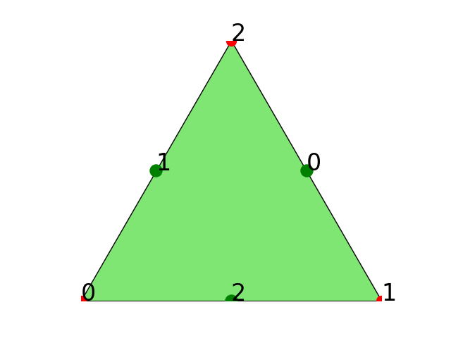
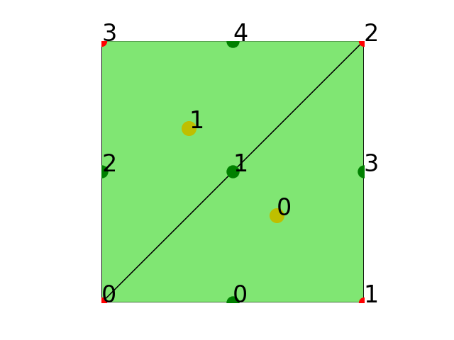

# 网格数据结构的数组化表示： edge

本文将介绍如何用 **数组化(array-oriented)** 的思考和编程方式构造网格数据结构中的 `edge` 数组。

所谓**数组化**， 就是从已知或者简单数组出发， 利用数组操作和运算， 获得目标数组的过程。 与其对应的就是**标量化**， 这是很多人常用到且更习惯的方式。 注意本文提到的**数组**指的是**一般的多维数组**。 而我们常用的**向量**这个词， 在数学的语境下通常是指**一维数组**， 所以为了避免语言对思维的限制， 在以后的文章中我会尽量不使用**向量化**这个词。

数组化的编程需要数组化的思维习惯。 要养成数组化的思维习惯， 当你面对一个编程问题时， 首先要养成问自己三个问题的习惯：

1. 我想获得的目标数组是什么？
2. 我手头有什么已知的数组？
3. 我需要生成什么样的中间的数组？

还是以 $[0, 1]^2$ 区域上有两个三角形单元的网格为例， 对应的 Python 代码为：

```
import numpy as np
# 网格节点数组
node = np.array([[0.0, 0.0],
                 [1.0, 0.0],
                 [1.0, 1.0],
                 [0.0, 1.0]], dtype=np.float)
# 网格单元数组
cell = np.array([[1, 2, 0],
                 [3, 0, 2]], dtype=np.int32)
NN = node.shape[0] # 网格中的节点个数
NC = cell.shape[0] # 网格中的单元个数
```   
**注意**， 上面的 `node`, `cell`, `NN` 和 `NC` 在以后的文章和程序表示意义都是固定的。 进一步， 我会用 `edge` 表示网格边数组， 用 `NE` 表示网格中边的个数。 记住这个约定， 可以帮助你更好的理解以后文章和程序代码。 后面我也会专门写一篇文章讲这些命名的约定。

<p>
<div align="center"></div>
<div align="center"> <em> 图 1, 四个顶点、两个单元的三角形网格。 </em></div>
</p>

对于第一个问题， 观察图中网格共有 5 条边， 每条边 2 个顶点， 而且可以分为两类：

* **内部边：** 被两个三角形单元共用的边。
* **边界边：** 只属于一个三角形单元。

下面首先定义清楚目标数组 `edge`， 并做一些适当的假定， 这样就可以回答第一个问题：
* `edge` 形状应为 `(NE, 2)`, 存储 `NE` 条**不重复的**边， 每条边有 2 个顶点。
* `edge[i, 0]` 和 `edge[i, 1]` 分别存储第 `i` 条边两个顶点的全局编号， 注意它们是 **`node` 数组的行号**。
* 如果第 `i` 条边是一条边界边， 则从`edge[i, 0]` 看向 `edge[i, 1]` 的左手边是区域内部。

对于第二个问题， 显然 `cell` 数组中已经包含了所有边的信息， 只要从它出发就可以提取出目标数组 `edge`。

对于第 3 个问题， 即需要什么样的中间数组？ 容易想到， 要首先把每个三角形单元的 3 条边提取出来。 当然这里存在一个边的局部编号问题。 给定一个三角形单元， 可以通过定义一个 `localEdge` 数组来定义每个单元的局部边：

```
localEdge = np.array([[1, 2],
                      [2, 0],
                      [0, 1]], dtype=np.int32)
```
上面生成的 `localEdge` 用下面的约定构造：

* 与单元局部第 `i` 个顶点相对的局部边局部编号设为 `i, 0<=i<3`。
* 每条局部边的的左手边是**单元的内部**。

见下图：


<div align="center"></div>
<div align="center"> <em> 图 2, 三角形单元顶点和边的局部编号。</em></div>


当然上面关于局部边的约定不是强制的， 你可根据需要给出自己的约定。

有了上面的 `localEdge`， 就可以把网格中所有单元的三个边都拿出来组成一个新的数组 `totalEdge`
```
totalEdge = cell[:, localEdge] # shape 为 (NC, 3, 2)
totalEdge = totalEdge.reshape(-1, 2) # shape 变为 (3*NC, 2)
```
`totalEdge` 是一个 `ndarray` 对象， 它的 `reshape` 成员函数可以改变数组的形状， 其中第 0 个参数 `-1`， 表示让 `reshape` 自己计算新数组的第 `0` 轴的长度。 最后的 `totalEdge` 数组， 就是把每个三角形单元的三条局部边先按单元顺序， 再按局部顺序排列的形状为 `(3*NC, 2)` 的二维数组。

这时 `totalEdge` 中已经包含 `edge` 数组需要的所有信息， 但是里面还有重复的边。 内部边会在 `totalEdge` 出现两次， 但注意因为 `localEdge` 的定义方法， 这两条重复边的方向是不一样的， 即两个顶点的排序刚好相反。 为了得到想要的 `edge`， 需要把重复的边去掉。 这里要用到 `sort` 和 `unique` 函数， 用法如下：

```
totalEdge0 = np.sort(totalEdge, axis=1)
edge0, i0, j = np.unique(totalEdge0, return_index=True, return_inverse=True, axis=0)
```
其中 `np.sort(totalEdge, axis=1)` 是把 `totalEdge` 每一行的两个值重新排序， 默认从小到大。 这样重复边两个顶点编号排序就一致了。 **注意**， 这里没有改变 `totalEdge` **行的排列顺序**。 下面解释 `np.unique` 的用法：

* 第 0 个参数为边顶点排序后的所有局部边数组 `totalEdge0`。
* 第 1 个参数 `return_index` 设为 `True`， 目的是为了返回 `i0`。
* 第 2 个参数 `return_inverse` 设为 `True`， 目的是为了返回 `j`。
* `edge0` 就是没有重复的边数组， 它和 `totalEdge0` 满足如下关系：
  + `edge0 == totalEdge0[i0]`
  + `totalEdge0 == edge0[j]`

**注意**， 上面的 `totalEdge0[i0]` 和  `edge[j]` 是指索引两个数组的行， 即第 0 轴， 此时后面的轴可以省略不写， 这和 Matlab 的索引语法是不同的， 所以 Numpy 数组的索引更加方便和灵活。

但 `edge0` 数组并不是我们想要的最终边数组， 因为它不能保证满足前面对边数组存储的约定， 特别是**边界边左手边是区域内部**的约定。 实际上， 我们可以利用**没有做边顶点排序**的 `totalEdge` 数组及 `i0` 数组来得到最终的边数组：

```
edge = totalEdge[i0] # 最终的边数组
NE = edge.shape[0] # 获得网格中边的个数, 即 `edge` 的行数
```

## 关系数组： cell2edge 和 edge2cell

网格中节点、边和单元之间的拓扑关系在有有限元编程中也经常用到， 因此也需要生成这些数组。 上面生成 `edge` 数组的过程中得到的 `i0` 和 `j` 实际上已经包含了边与单元之间的拓扑关系， 下面介绍如何生成 `cell2edge` 和 `edge2cell` 数组。

首先， 先定义好这两个数组：

* `cell2edge` 的形状为 `(NC, 3)`， 其第 `i` 行的三个值 `cell2edge[i, 0]`, `cell2edge[i, 1]` 和 `cell2edge[i, 2]` 分别存储第 `i` 个单元三个局部边的全局编号， 即在 `edge` 数组中的行号。
* `edge2cell` 的形状为 `(NE, 4)`, 其中第 `i` 行有四个值， 其中 `edge2cell[i, 0]` 和 `edge2cell[i, 1]` 分别存储第 `i` 条边的左手边单元和右手边单元的全局编号， 而 `edge2cell[i, 2]` 和 `edge2cell[i, 3]` 分别存储第 i 条边在其左右单元中的局部编号。

利用 `j`， 很容易得到 `cell2edge` 数组， 代码如下：

```
cell2edge = j.reshape(NC, 3)
```

最后讨论如何得到 `edge2cell`。 首先利用 `j`, 可以得到另外一个一维数组 `i1`， 它和 `i0` 的长度是一样的， 都 是 `NE`， 而且也有 `edge == totalEdge[i1, :]`。 但与 `i0` 的不同之处在于， 对于第 `i` 条边：

* 如果是内部边， 则 `i0[i] != i1[i]`， 它们是同一条内部边在 `totalEdge0` 中出现两次的行号。
* 如果是边界边， 则 `i0[i] == i1[i]`， 它们是同一条边界边在 `totalEdge0` 中出现一次的行号。

下面代码给出用 `j`， 得到 `i1` 的方法

```
E = 3 # 每个三角形有 3 条边
i1 = np.zeros(NE, dtype=self.itype) # 分配空间
i1[j] = range(3*NC) # totalEdge0 的行数是 3*NC, j 的长度也是 3*NC
```
上面的最后一行代码中， `i1` 数组的第 `i` 个位置会赋值 1 次（边界边）或者 2 次（内部边）。 内部边第 2 次赋值时， 就把第 1 次的赋值覆盖了， 从而达到得到内部边在 `totalEdge0` 中另一个行号的目的。

最后， 利用下面的代码， 就可以得到 `edge2cell`数组

```
edge2cell = np.zeros((NE, 4), dtype=np.int32)
edge2cell[:, 0] = i0//E # 每条边的左边单元的编号
edge2cell[:, 1] = i1//E # 每条边的右边单元的编号
edge2cell[:, 2] = i0%E  # 每条边在其左边单元中的局部编号
edge2cell[:, 3] = i1%E  # 每条边在其右边单元中的局部编号
```
**注意**， `//` 是求商运算符， `%`是求余运算符。 如果第 `i` 条边是边界边， 则 `edge2cell[i, 0] == edge2cell[i, 1]`， 同样 `edge2cell[i, 2] == edge2cell[i, 3]`。 这样我们就得到了一种判断边界边的方法：

```
isBdEdge = edge2cell[i, 0] == edge2cell[i, 1]
```
在我们处理边界条件时会用到这行代码。

下面给出生成算法过程中生成的数组， 以便你更好的理解上面的算法。

<div align="center"></div>
```
totalEdge:
 [[2 0]
  [0 1]
  [1 2]
  [0 2]
  [2 3]
  [3 0]]
totalEdge0:
 [[0 2]
  [0 1]
  [1 2]
  [0 2]
  [2 3]
  [0 3]]
i0:
 [1 0 5 2 4]
i1:
 [1 3 5 2 4]
j:  
 [1 0 3 1 4 2]
edge:
 [[0 1]
  [2 0]
  [3 0]
  [1 2]
  [2 3]]
edge2cell:
  [[0 0 1 1]
   [0 1 0 0]
   [1 1 2 2]
   [0 0 2 2]
   [1 1 1 1]]   
cell2edge:
    [[1 0 3]
     [1 4 2]]
```

## 写在后面

你读过文章后， 强烈建议在自己的机器测试一下上面的代码， 以加深对算法的理解。 因为这个算法是网格数据结构中生成网格实体拓扑关系核心算法， 你理解了它， 就可以推广到其它类型的网格上的去， 包括三维的网格。 我把所有的代码贴到这里， 方便你去测试。

有问题想和我讨论， 可以发邮件给我： weihuayi@xtu.edu.cn.

```
import numpy as np

from fealpy.mesh import TriangleMesh
import matplotlib.pyplot as plt
# 网格节点数组
node = np.array([[0.0, 0.0],
                 [1.0, 0.0],
                 [1.0, 1.0],
                 [0.0, 1.0]], dtype=np.float)
# 网格单元数组
cell = np.array([[1, 2, 0],
                 [3, 0, 2]], dtype=np.int32)
NN = node.shape[0] # 网格中的节点个数
NC = cell.shape[0] # 网格中的单元个数

localEdge = np.array([[1, 2],
                      [2, 0],
                      [0, 1]], dtype=np.int32)

totalEdge = cell[:, localEdge] # shape 为 (NC, 3, 2)
totalEdge = totalEdge.reshape(-1, 2) # shape 变为 (3*NC, 2)
print('totalEdge:\n', totalEdge)

totalEdge0 = np.sort(totalEdge, axis=1)
print('totalEdge0:\n', totalEdge0)

edge0, i0, j = np.unique(totalEdge0, return_index=True, return_inverse=True, axis=0)
print('j:\n', j)

cell2edge = j.reshape(NC, 3)
print('cell2edge:\n', cell2edge)

edge = totalEdge[i0] # 最终的边数组
print('edge:\n', edge)

E = 3 # 每个三角形有 3 条边
NE = edge.shape[0] # 获得网格中边的个数, 即 `edge` 的行数
i1 = np.zeros(NE, dtype=np.int32) # 分配空间
i1[j] = range(3*NC) # totalEdge0 的行数是 3*NC, j 的长度也是 3*NC

print('i0:\n', i0)
print('i1:\n', i1)

edge2cell = np.zeros((NE, 4), dtype=np.int32)
edge2cell[:, 0] = i0//E # 得到每条边的左边单元
edge2cell[:, 1] = i1//E # 得到每条边的右边单元
edge2cell[:, 2] = i0%E  # 得到每条边的在左边单元中的局部编号
edge2cell[:, 3] = i1%E  # 得到每条边在其右边单元中的局部编号

print('edge2cell:\n', edge2cell)


mesh = TriangleMesh(node, cell)
mesh.print()
fig = plt.figure()
axes = fig.gca()
mesh.add_plot(axes)
mesh.find_node(axes, showindex=True)
mesh.find_cell(axes, showindex=True)
mesh.find_edge(axes, showindex=True)
plt.savefig('numpy-mesh-edge.png')
plt.show()
```
