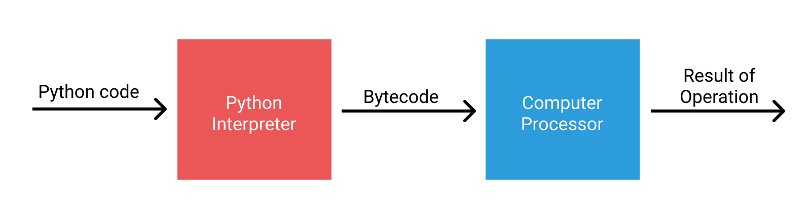
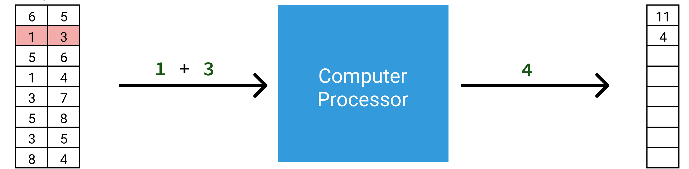
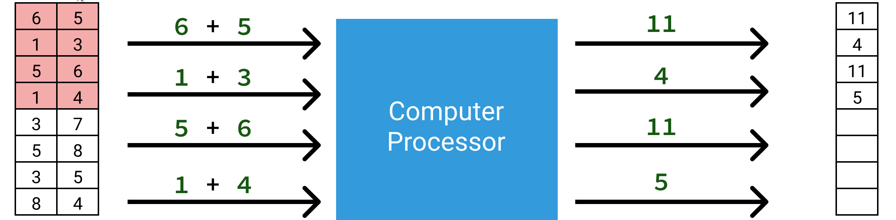

# Numpy

Python 是一门**高级计算机编程语言（high-level computer language)**, 它让编程变的非常容易， 这是它能流行的重要原因之一。 当你执行 Python 代码时， Python 解释器首先把代码转化为计算机可理解的**字节码(bytecode)**， 然后再执行。 

用 Python 写程序你基本不用关心内存管理的问题， 也不用关心 CPU 具体要做什么操作， 这一切都由 Python 解释器负责处理， 所以用 Python 编码速度会很快， 但执行的速度快不快是另一会儿事儿。 前面讲过 Python 里面一切皆是对象， 就连最基本的整型和浮点型都是对象。 Python 在它们上面附加了很多其它的数据， 这些数据是 Python 能够替你管理内存和 CPU 操作必须要的数据， 而这些额外数据的处理会增加程序的负担。 因此， 获得编码容易的好处， 就需要付出执行速度的代价， 天下没有免费的东西。

而在科学计算中， 往往要对大量的整数或浮点数进行运算， 而且对程序的执行速度要求很高。 这时直接用 Python 的整型和浮点型（比如用前面讲的列表存储）就会大大拖慢程序的执行速度， 从这个角度来说， Python 语言本身是不适合科学计算的， 其实 Guido van Rossum 设计 Python 的初衷就不是为了科学计算。 但是 Python 的易用性吸引了科学计算圈子里的人。

<figure class="half">
    
    
</figure>

>  “Python 这么好用！ 没有我想要的功能？！ 那我们就来做一个吧！” 只有在开源世界， 你才可以这么随意和任性。

于是就有了后来的 [Numpy](http://www.numpy.org/)。 Numpy 是专门为 Python 设计的，使得 Python 可以支持大型多维数及其相关的运算， 从此科学计算人的日子更好过一点了。

Numpy 提供的多维数组 `ndarray` 和 Python 内置的列表(list)类型表面上看起来很相似， 但它们存储数据的方式完全不同， 见下图, 它很好的展示了 `ndarray` 的存储模型与列表的不同

因此相比于列表， Numpy 的 `ndarray` 提供了更加高效的存储和数据操作， 更适用于科学计算和数据科学， 它现在已经是整个 Python 科学计算和数据科学工具生态系统的核心。

Numpy 数组的操作可以很快，也可以很慢， 关键是有没有利用**向量化**的操作, 下面两图生动地展示了两列数对应元素相加时的两种操作方式： 第一种是**标量化**的方式， CPU 一次只计算1 组数的加法; 第二种是**向量化**的方式， 一次计算 4 组数的加法， 速度轻松提高 4 倍！

其中向量化的方式很好的利用了 CPU 的**单指令流多数据流（SIMD）** 功能， 所以更加高效。 而 Numpy 的向量化运算是通过**通用函数(ufunc)** 实现的。 

后续的文章中，我会结合科学计算编程来介绍 Numpy 的多维数组对象 `ndarray` 和通用函数 `ufunc`的相关知识和用法。
